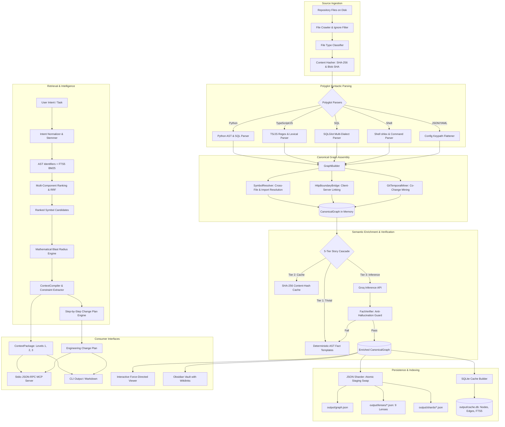

# System Overview

## Purpose and Scope

RepoPeek is a local semantic code intelligence engine designed to bridge the gap between complex software repositories and low-context AI coding agents. Rather than feeding raw source files or indiscriminate grep dumps to language models, RepoPeek deterministically indexes the repository down to atomic symbols and relational dependencies, computes mathematical blast-radius trees, and compiles minimal, evidence-backed context packages (<500 to 1500 tokens).

---

## End-to-End Processing Architecture

The following diagram traces the end-to-end data transformation pipeline from repository files on disk to external agent consumption:

---

## Core Pipeline Stages

### 1. Ingestion and Discovery
- **Input:** Target repository root path.
- **Components:** [`crawler.py`](file:///c:/Users/pkumar2/OneDrive%20-%20Data%20Axle/Documents/AI_INIT/Repopeek/repopeek/discovery/crawler.py), [`classifier.py`](file:///c:/Users/pkumar2/OneDrive%20-%20Data%20Axle/Documents/AI_INIT/Repopeek/repopeek/discovery/classifier.py), [`hasher.py`](file:///c:/Users/pkumar2/OneDrive%20-%20Data%20Axle/Documents/AI_INIT/Repopeek/repopeek/discovery/hasher.py), [`ignore.py`](file:///c:/Users/pkumar2/OneDrive%20-%20Data%20Axle/Documents/AI_INIT/Repopeek/repopeek/discovery/ignore.py).
- **Behavior:** Deterministic directory tree walk sorting folders and files alphabetically. Evaluates ignore rules (`.repopeekignore`, standard ignores), skips binary files via null-byte inspection, skips files exceeding `max_file_size_kb` (default 2048 KB), and computes SHA-256 and git blob SHAs.
- **Output:** List of `DiscoveredFile` records.

### 2. Polyglot Syntactic Parsing
- **Components:** [`repopeek/parsers/`](file:///c:/Users/pkumar2/OneDrive%20-%20Data%20Axle/Documents/AI_INIT/Repopeek/repopeek/parsers).
- **Behavior:**
  - `PythonParser`: Standard library `ast` parsing extracting classes, methods, functions, docstrings, imports, call invocations, parameter signatures, return types, raises, catches, data writes (`WRITES`), data reads (`READS`), and embedded SQL strings (via SQLGlot). Features a regex fallback parser for syntax errors.
  - `TypeScriptParser`: Pure-Python regex and lexical scanner extracting TypeScript interfaces, type aliases, classes, methods, functions, arrow functions, imports, exports, client HTTP calls (`fetch`, `axios`), and cyclomatic complexity without Node.js or npm dependencies.
  - `SqlParser`: Uses `sqlglot` to parse SQL scripts across Oracle, Postgres, and ANSI dialects into statements, tables (`sql_table`), queries (`sql_query`), writes (INSERT/UPDATE/MERGE), and reads (SELECT/JOIN).
  - `ShellParser`: Uses standard library `shlex` to tokenize shell scripts, extracting command pipelines, environment variable assignments and reads, and executed script targets (`RUNS_SCRIPT`).
  - `JsonConfigParser` / `YamlConfigParser`: Recursively flattens hierarchical keypaths (e.g. `database.pool.size`) into atomic configuration nodes.
- **Output:** Language-agnostic `ParseResult` objects containing atomic `NodeCard` definitions and raw `Edge` declarations.

### 3. Canonical Graph Assembly and Cross-Boundary Resolution
- **Components:** [`builder.py`](file:///c:/Users/pkumar2/OneDrive%20-%20Data%20Axle/Documents/AI_INIT/Repopeek/repopeek/graph/builder.py), [`resolver.py`](file:///c:/Users/pkumar2/OneDrive%20-%20Data%20Axle/Documents/AI_INIT/Repopeek/repopeek/graph/resolver.py), [`bridges/http.py`](file:///c:/Users/pkumar2/OneDrive%20-%20Data%20Axle/Documents/AI_INIT/Repopeek/repopeek/bridges/http.py), [`temporal/miner.py`](file:///c:/Users/pkumar2/OneDrive%20-%20Data%20Axle/Documents/AI_INIT/Repopeek/repopeek/temporal/miner.py).
- **Behavior:**
  - Instantiates `CanonicalGraph` and adds all parsed nodes.
  - `SymbolResolver` links raw string targets to concrete node IDs: matches local file scopes, resolves imports through relative paths and dotted package paths, matches OOP inheritance (`INHERITS`), binds SQL tables and config keypaths, and resolves environment variable def-use pairs.
  - `HttpBoundaryBridge` extracts backend server route endpoints (FastAPI, Flask, Express decorators) and frontend client calls (`fetch`, `axios`), normalizes parameterized path segments into wildcard templates (`/api/users/:param`), and adds cross-language `INVOKES` edges with confidence `RESOLVED`.
  - `GitTemporalMiner` analyzes git commit history, computes pairwise co-change probabilities using exponential half-life time decay, and synthesizes `CO_CHANGED_WITH` edges.
- **Output:** Unified, fully linked `CanonicalGraph`.

### 4. 5-Tier Semantic Enrichment and Anti-Hallucination Guard
- **Components:** [`enrichment/pipeline.py`](file:///c:/Users/pkumar2/OneDrive%20-%20Data%20Axle/Documents/AI_INIT/Repopeek/repopeek/enrichment/pipeline.py), [`summarizer.py`](file:///c:/Users/pkumar2/OneDrive%20-%20Data%20Axle/Documents/AI_INIT/Repopeek/repopeek/enrichment/summarizer.py), [`verifier.py`](file:///c:/Users/pkumar2/OneDrive%20-%20Data%20Axle/Documents/AI_INIT/Repopeek/repopeek/enrichment/verifier.py), [`governor.py`](file:///c:/Users/pkumar2/OneDrive%20-%20Data%20Axle/Documents/AI_INIT/Repopeek/repopeek/enrichment/governor.py).
- **Behavior:**
  - Tier 1: Trivial nodes (complexity == 1, 0 calls/reads/writes, configs, files) bypass LLM and receive deterministic templates from AST facts.
  - Tier 2: Content-hash disk cache checks node SHA-256 content hash.
  - Tier 3: If offline or budget exhausted by `CostGovernor`, falls back to deterministic templates. Otherwise calls Groq API (fast model `qwen/qwen3.8-27b` or strong model `openai/gpt-oss-120b`).
  - Tier 4: Bottom-up hierarchical aggregation: functions/methods -> classes -> modules.
  - Tier 5: `FactVerifier` cross-checks generated summary against AST facts. If the story hallucinates database tables, external calls with 0 actual calls, or raw markdown, it is rejected and replaced with a deterministic template.
- **Output:** Fully enriched `CanonicalGraph` with validated `NodeStory` on every card.

### 5. Persistence and Materialization
- **Components:** [`storage/json_store.py`](file:///c:/Users/pkumar2/OneDrive%20-%20Data%20Axle/Documents/AI_INIT/Repopeek/repopeek/storage/json_store.py), [`storage/sqlite_cache.py`](file:///c:/Users/pkumar2/OneDrive%20-%20Data%20Axle/Documents/AI_INIT/Repopeek/repopeek/storage/sqlite_cache.py).
- **Behavior:**
  - Serializes graph into a staging directory `.tmp_build_<uuid>` to ensure crash-safe atomic swaps.
  - Generates `graph.json`, 9 specialized sub-graphs (`lenses/*.json`), source-file-aligned shards (`shards/*.json`), and `manifest.json`.
  - Builds an indexed SQLite traversal cache (`cache.db`) with tables `metadata`, `nodes`, `edges`, indices on endpoints and kinds, and a virtual table `nodes_fts` using SQLite FTS5 for sub-millisecond ranked BM25 retrieval.
- **Output:** Deterministic disk artifacts under `./output` or target `.repopeek`.

### 6. Retrieval, Blast Radius, and Context Compilation
- **Components:** [`retrieval/intent.py`](file:///c:/Users/pkumar2/OneDrive%20-%20Data%20Axle/Documents/AI_INIT/Repopeek/repopeek/retrieval/intent.py), [`graph/blast_radius.py`](file:///c:/Users/pkumar2/OneDrive%20-%20Data%20Axle/Documents/AI_INIT/Repopeek/repopeek/graph/blast_radius.py), [`context/compiler.py`](file:///c:/Users/pkumar2/OneDrive%20-%20Data%20Axle/Documents/AI_INIT/Repopeek/repopeek/context/compiler.py).
- **Behavior:**
  - Converts natural language tasks into query components (identifiers, concepts, stems, compounds, negative exclusions).
  - Searches AST identifiers and SQLite FTS5, ranking candidates with a 6-component weighted scoring formula:
    `Score = 0.35 * exact_match + 0.25 * identifier + 0.20 * token_overlap + 0.10 * lexical + 0.05 * path_relevance + 0.05 * kind_preference`.
  - Calculates mathematical multi-hop blast radius using path decay formulas:
    - Path Confidence: $PathConfidence(P) = \min(0.99, \prod c_i \cdot e^{-0.25(h-1)})$
    - Combined Multi-Path Confidence: $CombinedConfidence(N) = \min(0.99, 1 - \prod (1 - PathConfidence(P_j)))$
    - Distance Decay Graph Score: $GraphScore(N) = CombinedConfidence(N) \cdot e^{-0.70(distance-1)}$
  - Partitions nodes into `direct` ($\ge 0.80$ or 1-hop), `indirect` ($\ge 0.20$), and hard-prunes `excluded` paths matching negative constraints.
  - Compiles multi-tier structural constraints (parameters, returns, exceptions, schema tables, behavioral invariants) and generates an ordered, risk-assessed step-by-step `ChangePlan`.
- **Output:** `ContextPackage` rendered in Markdown (Level 1, 2, or 3) within specified token budget.

---

## Runtime, Process, and Service Boundaries

| Boundary Dimension | Description |
|---|---|
| **Process Model** | Single OS process execution. When running queries or compilation, runs synchronously. When serving MCP or the graph viewer, runs as an event loop or threaded HTTP server (`ThreadingHTTPServer`). |
| **Network Boundary** | In default offline mode, RepoPeek makes **zero outbound network connections**. When LLM enrichment is enabled without offline flags, outbound HTTPS requests are made to `https://api.groq.com/openai/v1/chat/completions`. |
| **Filesystem Boundary** | Reads source code from target repository path (`--repo-path`). Writes artifacts exclusively to `--output-dir` (default `./output` or target `.repopeek`). Incremental file updates write atomically to staging files before replacement. |
| **External Service Dependencies** | None required. All parsing, graph traversal, FTS5 BM25 search, SQLite CTE queries, and context compilation run using Python stdlib and local SQLite. |

---

## Consumer Interfaces

1. **CLI (`repopeek.cli`):** Full command-line interface supporting index creation, queries (`--lookup`, `--impact`, `--trace`, `--pack`, `--resolve`, `--explain`, `--context`, `--plan`, `--co-changes`, `--routes`), incremental updates (`--update`), and evaluation (`--evaluate`).
2. **MCP Server (`RepoPeekMCPServer`):** Standard stdio JSON-RPC server implementing 10 agent intelligence tools for AI IDEs (Antigravity, Cursor, Claude Desktop).
3. **Interactive Graph Viewer (`repopeek.viewer`):** Local web server (`http://127.0.0.1:8765`) serving force-directed SVG/Canvas graphs with 9 switchable lenses, real-time node drawers, and blast radius highlighting.
4. **Obsidian Vault Exporter (`repopeek.storage.obsidian_exporter`):** Exports graph nodes as atomic Markdown notes with frontmatter and bidirectional `[[wikilinks]]`, organized into categorized directories (`Modules`, `Classes`, `Functions`, `Entities`, `Configs`) compatible with Obsidian Desktop Graph View.
5. **Incremental Watch Daemon (`RepoPeekWatcher`):** Background filesystem watcher polling repository files and incrementally re-indexing modified files in <50ms without full rebuilds.
