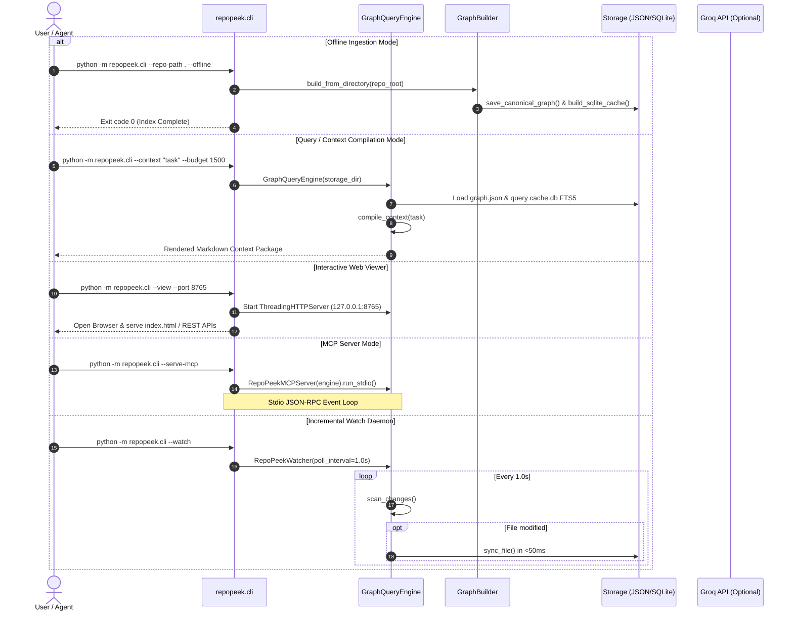
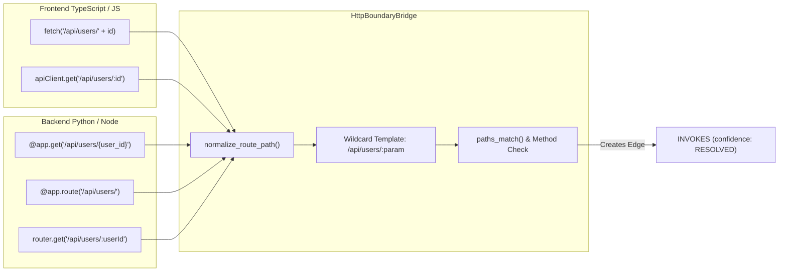

# Architecture Specification

## 1. Logical Architecture

RepoPeek is organized into four distinct architectural layers, designed according to the **Decision Ladder**:
`YAGNI -> Existing codebase -> Stdlib -> Existing dependencies -> Smallest correct implementation`.

```mermaid
graph TD
    subgraph L1[Layer 1: Deterministic Substrate]
        D_Disc[Discovery & Ignore Scanner]
        D_Parse[Polyglot Parsers: AST, SQLGlot, Shlex, Config]
        D_Graph[Graph Assembly & Local Edges]
        D_Res[Cross-File Symbol, Import & Def-Use Resolver]
        D_Bridge[Cross-Language HTTP Boundary Bridge]
        D_Temp[Git Temporal Co-Change Miner]
    end

    subgraph L2[Layer 2: Semantic Story Overlay]
        S_Filter[Trivial Node Filter]
        S_Cache[SHA-256 Content-Hash Story Cache]
        S_Gov[Cost Governor & Token Tracker]
        S_LLM[Groq Inference Provider]
        S_Ver[FactVerifier: AST Anti-Hallucination Guard]
    end

    subgraph L3[Layer 3: Persistence & Caching]
        P_JSON[Sharded Deterministic JSON & Lenses]
        P_Atomic[Atomic Staging Directory Swap]
        P_SQL[SQLite Cache: Nodes, Edges, CTE Traversal]
        P_FTS[SQLite FTS5 Full-Text Index]
    end

    subgraph L4[Layer 4: Intelligence, Serving & Tooling]
        I_Intent[Intent Normalizer & Compound Generator]
        I_Rank[AST + BM25 Reciprocal Rank Fusion]
        I_Blast[Mathematical Traversal & Blast Radius Engine]
        I_Comp[Context Compiler: Levels 1-3 & Constraints]
        I_Plan[Step-by-Step Change Plan Engine]
        T_MCP[Stdio JSON-RPC MCP Server: 10 Tools]
        T_CLI[CLI Interface & Query Dispatch]
        T_View[Force-Directed Web Viewer: Port 8765]
        T_Obs[Obsidian Markdown Vault Exporter]
        T_Watch[Incremental Watch Daemon: <50ms]
    end

    L1 --> L2
    L1 --> L3
    L2 --> L3
    L3 --> L4
    L1 --> L4
```



### Layer Responsibilities
1. **Deterministic Substrate (Layer 1):** Extracts unassailable facts directly from source syntax. It NEVER uses an LLM for anything extractable statically.
2. **Semantic Story Overlay (Layer 2):** Injects high-level functional summaries onto code cards. Every generated story is strictly bounded and verified against Layer 1 facts.
3. **Persistence & Caching (Layer 3):** Preserves graph state deterministically across process runs. Guarantees atomic writes and provides sub-millisecond recursive queries and text search.
4. **Intelligence & Serving (Layer 4):** Consumes the graph to answer high-level engineering questions, compile context packages for external AI coding agents, and expose standard interfaces.

---

## 2. Runtime Architecture and Process Lifecycle

RepoPeek operates as a single OS process across several operational modes:



---

## 3. Mathematical Models and Scoring Formulas

RepoPeek replaces naive graph searches with calibrated mathematical formulations across blast-radius traversal, retrieval ranking, and temporal decay.

### 3.1 Mathematical Traversal Confidence Scoring

#### A. Edge Prior Confidence
Each graph edge has a calibrated prior probability $c_i \in [0.30, 0.95]$ derived from its relationship type and resolution certainty:

| Edge Type / Confidence | Prior Confidence ($c_i$) |
|---|---|
| `CALLS`, `INHERITS`, `IMPLEMENTS`, `DEFINED_IN` | 0.95 |
| `TESTS_CODE` | 0.90 |
| `WRITES`, `READS`, `EMBEDS_SQL` | 0.85 |
| `IMPORTS`, `RUNS_SCRIPT` | 0.80 |
| `INVOKES` (HTTP Cross-Boundary) | 0.75 |
| `CO_CHANGED_WITH` | 0.70 |
| `ambiguous`, `dynamic` | 0.50 |
| `external` | 0.40 |
| `unresolved` | 0.30 |

#### B. Multi-Hop Path Confidence Decay
For a traversal path $P = (e_1, e_2, \dots, e_h)$ of length $h$, confidence decays exponentially with hop distance:

$$\text{PathConfidence}(P) = \min\left(0.99, \prod_{i=1}^{h} c_i \cdot \exp\left(-0.25 \cdot (h - 1)\right)\right)$$

- At $h=1$, decay factor is $\exp(0) = 1.0$.
- At $h=2$, decay factor is $\exp(-0.25) \approx 0.7788$.
- At $h=3$, decay factor is $\exp(-0.50) \approx 0.6065$.

#### C. Multi-Path Confidence Combination
When a target node $N$ is reachable via multiple independent paths $\{P_1, P_2, \dots, P_k\}$, the combined probability that $N$ is affected is calculated using the noisy-or model:

$$\text{CombinedConfidence}(N) = \min\left(0.99, 1 - \prod_{j=1}^{k} \left(1 - \text{PathConfidence}(P_j)\right)\right)$$

#### D. Distance-Decayed Graph Score
To measure relevance for ranking context nodes, the combined confidence is discounted by the shortest hop distance:

$$\text{GraphScore}(N) = \text{CombinedConfidence}(N) \cdot \exp\left(-0.70 \cdot (\text{distance} - 1)\right)$$

#### E. Blast Radius Partitioning
- **Direct Blast Radius:** Nodes with $\text{distance} = 1$ or $\text{CombinedConfidence}(N) \ge 0.80$.
- **Indirect Blast Radius:** Nodes with $\text{CombinedConfidence}(N) \ge \text{threshold}$ (default $0.20$).
- **Excluded Blast Radius:** Nodes with confidence $< 0.20$, nodes exceeding `max_depth` (default 5), or nodes matching explicit negative exclusion patterns.

---

### 3.2 Task-to-Symbol Hybrid Retrieval Scoring

Candidate symbols are evaluated using a calibrated 6-component linear model:

$$\text{RetrievalScore}(S) = 0.35 \cdot E + 0.25 \cdot I + 0.20 \cdot T + 0.10 \cdot L + 0.05 \cdot P + 0.05 \cdot K$$

Where:
- $E$ (**Exact Match**): 1.0 if query exactly matches symbol URI, qualified name, or bare identifier; 0.0 otherwise.
- $I$ (**Identifier Match**): Fraction of query code identifiers matching the symbol name, snake_case components, or camelCase tokens.
- $T$ (**Token Overlap**): Normalized Jaccard overlap between query concept terms and the symbol's name, signature, and story.
- $L$ (**Lexical FTS5 Score**): Normalized BM25 score from the SQLite `nodes_fts` index.
- $P$ (**Path Relevance**): Overlap between query file/path references and the node's source file span.
- $K$ (**Kind Preference**): Architectural weight prioritizing actionable symbols (`function` = 1.0, `method` = 1.0, `class` = 0.9) over structural cards (`file` = 0.5, `variable` = 0.3).

#### Reciprocal Rank Fusion (RRF) Fallback
When blending disparate ranking signals without score normalization, RRF is computed with smoothing constant $k = 60$:

$$\text{RRFScore}(d) = \sum_{m \in M} \frac{1}{k + r_m(d)}$$

---

### 3.3 Git Temporal Co-Change Mining

For any commit history, the co-change weight of files $A$ and $B$ within commit $c$ at timestamp $t_c$ decays with half-life $t_{1/2} = 180\text{ days}$:

$$\lambda = \frac{\ln(2)}{t_{1/2}} \approx \frac{0.69315}{180 \cdot 86400}\text{ sec}^{-1}$$

$$w_c = \exp\left(-\lambda \cdot (t_{\text{ref}} - t_c)\right)$$

The conditional probability that modifying file $A$ requires changing file $B$ is:

$$P(B \mid A) = \frac{\sum_{c \in C_{A \cap B}} w_c}{\sum_{c \in C_A} w_c}$$

Edges with $P(B \mid A) \ge 0.25$ and at least 2 co-commits are materialized as `CO_CHANGED_WITH` edges.

---

## 4. Cross-Language HTTP Boundary Bridge

RepoPeek bridges disconnected frontend and backend call graphs without language-server protocol (LSP) dependencies:



---

## 5. Storage and Indexing Architecture

RepoPeek uses a dual-format persistence model:
1. **Deterministic JSON Artifacts:** Human-readable, git-trackable, content-addressed files.
2. **SQLite CTE Cache:** High-speed traversal engine with full-text search.

```text
output/ (or target-repo/.repopeek/)
├── graph.json                # Complete CanonicalGraph (nodes sorted by ID, edges sorted)
├── manifest.json             # Artifact manifest with SHA-256 hashes and node counts
├── lenses/                   # 9 precomputed sub-graphs
│   ├── module.json
│   ├── symbol.json
│   ├── call.json
│   ├── class.json
│   ├── data.json
│   ├── data_entity.json
│   ├── config.json
│   ├── process.json
│   └── bridges.json
├── shards/                   # File-level graph shards
│   ├── src__billing__invoice.py.json
│   └── ...
└── cache.db                  # Derived SQLite database (recursive CTEs + FTS5 index)
```

### Atomic Directory Swap Protocol
To prevent data corruption during process interruption or concurrent reads:
1. Writes are performed inside `.tmp_build_<uuid>`.
2. All JSON files, shards, lenses, and manifest are serialized and hashed.
3. If the destination directory exists, it is renamed to `.tmp_old_<uuid>`.
4. The staging directory is renamed to the final destination path.
5. Old staging directories are purged.
