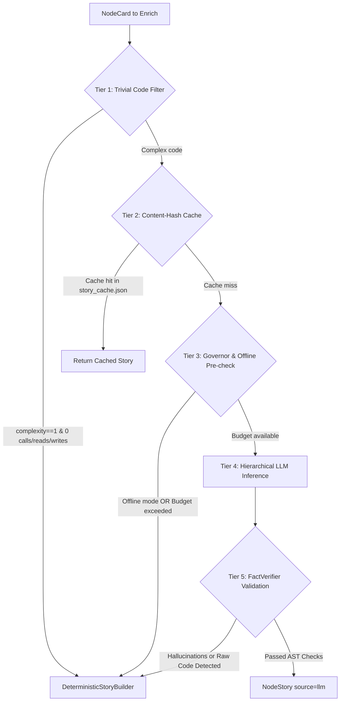

# Component: Semantic Enrichment & Verification Pipeline

## 1. Overview
The semantic enrichment pipeline layers concise, high-confidence natural language summaries (`NodeStory`) onto property graph nodes. It enforces a strict **5-Tier Cost Cascade** to minimize LLM token expenditure and an anti-hallucination guard (`FactVerifier`) to ensure generated claims match AST facts.

- **Package:** `repopeek.enrichment`, `repopeek.llm`
- **Source Files:**
  - [`repopeek/enrichment/pipeline.py`](file:///c:/Users/pkumar2/OneDrive%20-%20Data%20Axle/Documents/AI_INIT/Repopeek/repopeek/enrichment/pipeline.py)
  - [`repopeek/enrichment/summarizer.py`](file:///c:/Users/pkumar2/OneDrive%20-%20Data%20Axle/Documents/AI_INIT/Repopeek/repopeek/enrichment/summarizer.py)
  - [`repopeek/enrichment/verifier.py`](file:///c:/Users/pkumar2/OneDrive%20-%20Data%20Axle/Documents/AI_INIT/Repopeek/repopeek/enrichment/verifier.py)
  - [`repopeek/enrichment/templates.py`](file:///c:/Users/pkumar2/OneDrive%20-%20Data%20Axle/Documents/AI_INIT/Repopeek/repopeek/enrichment/templates.py)
  - [`repopeek/enrichment/governor.py`](file:///c:/Users/pkumar2/OneDrive%20-%20Data%20Axle/Documents/AI_INIT/Repopeek/repopeek/enrichment/governor.py)
  - [`repopeek/enrichment/cache.py`](file:///c:/Users/pkumar2/OneDrive%20-%20Data%20Axle/Documents/AI_INIT/Repopeek/repopeek/enrichment/cache.py)
  - [`repopeek/llm/groq.py`](file:///c:/Users/pkumar2/OneDrive%20-%20Data%20Axle/Documents/AI_INIT/Repopeek/repopeek/llm/groq.py)
- **Primary Tests:**
  - [`tests/test_story_cascade.py`](file:///c:/Users/pkumar2/OneDrive%20-%20Data%20Axle/Documents/AI_INIT/Repopeek/tests/test_story_cascade.py)
  - [`tests/test_llm_provider.py`](file:///c:/Users/pkumar2/OneDrive%20-%20Data%20Axle/Documents/AI_INIT/Repopeek/tests/test_llm_provider.py)

---

## 2. The 5-Tier Story Cascade



### Tier Breakdown
1. **Tier 1 (Trivial Node Filter):**
   - Identifies simple boilerplate functions where $\text{complexity} == 1$, $\text{calls} == 0$, and no variables or tables are read or written.
   - Also bypasses plain files, configs, and tables.
   - Bypasses LLM entirely; receives zero-cost deterministic summary from AST facts.
2. **Tier 2 (Content-Hash Cache):**
   - Uses `cache_key = cache.make_key(node.content_hash, model_tier="fast")`.
   - If present in `output/story_cache.json`, reuses the verified narrative.
3. **Tier 3 (Budget & Capability Pre-check):**
   - Checks if provider is `DeterministicFallbackProvider` (used in `--offline` mode).
   - `CostGovernor` verifies if token cap (`max_tokens`, default 100,000) or financial cap (`max_cost_usd`, default $1.00) would be breached. If breached, records fallback and reverts to deterministic template.
4. **Tier 4 (Hierarchical LLM Inference):**
   - Model selection: Uses FAST model (`qwen/qwen3.8-27b`) if complexity $< 10$; STRONG model (`openai/gpt-oss-120b`) if complexity $\ge 10$.
   - Hierarchical Map-Reduce: Class summaries receive child method summaries; module summaries receive child class and function summaries.
5. **Tier 5 (FactVerifier Anti-Hallucination Guard):**
   - Validates generated summary against AST ground truth before acceptance.

---

## 3. FactVerifier Anti-Hallucination Guard

Defined in [`repopeek/enrichment/verifier.py`](file:///c:/Users/pkumar2/OneDrive%20-%20Data%20Axle/Documents/AI_INIT/Repopeek/repopeek/enrichment/verifier.py):

| Validation Check | Trigger Condition | Outcome if Violated |
|---|---|---|
| **Non-Empty** | Empty string returned by LLM | Rejection (`is_valid=False`, confidence: `low`). |
| **Word Count Cap** | Words $> 60$ | Rejection. Narrative must remain a single concise sentence for sub-500-token packaging. |
| **Raw Code Dump** | Contains ` ``` `, `def `, or `class ` | Rejection. Models dumping raw code instead of narrative are rejected. |
| **Table Entity Grounding** | Text mentions database tables not present in `facts.reads` or `facts.writes` | Rejection. Prevents LLMs from inventing phantom database schemas. |
| **Call Count Grounding** | Text claims "calls service" or "sends HTTP" when `facts.calls == 0` | Rejection. Prevents LLMs from inventing external RPC/HTTP invocations. |

If `verify()` rejects a story, RepoPeek discards the LLM output and applies `DeterministicStoryBuilder.build_story(node)`.
