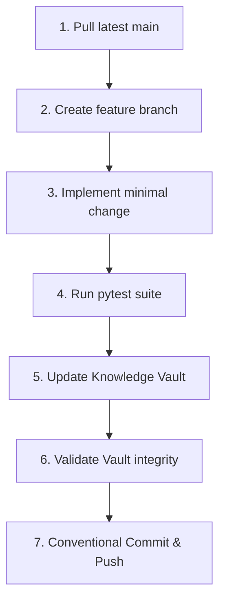

# Development Workflow

This document outlines the standard engineering workflow, coding standards, verification protocols, and repository conventions for contributing to RepoPeek.

---

## 1. Local Development Cycle



---

## 2. Engineering Conventions

### 2.1 The Ponytail Protocol (Full Mode)
RepoPeek strictly adheres to the Ponytail decision ladder to eliminate unnecessary abstraction and bloat:
1. **Question Necessity (YAGNI):** Does this feature or abstraction truly need to exist?
2. **Existing Codebase:** Can an existing class or helper in `repopeek/` solve this?
3. **Standard Library:** Prefer Python's standard library (`pathlib`, `ast`, `sqlite3`, `json`, `re`, `threading`) before adding third-party dependencies.
4. **Existing Dependencies:** Leverage existing packages (`networkx`, `pydantic`, `sqlglot`) rather than importing new ones.
5. **Smallest Correct Implementation:** One line before fifty; no speculative enterprise wrappers.

### 2.2 Correctness Boundaries
Never compromise:
- Syntax error tolerance in AST parsers (always provide heuristic or graceful recovery).
- Cross-platform path handling (always normalize paths to POSIX `/` inside node IDs and spans).
- Test coverage for mathematical blast radius propagation and context compilation.

### 2.3 Tone and Formatting Rules
- **Zero Emojis:** Prohibited in commit messages, log statements, documentation titles, and code comments.
- **Clickable Code References:** All markdown documentation referencing codebase files must use the `file:///` URI scheme with forward slashes.

---

## 3. Local Verification Protocol

Before opening a pull request or merging changes, execute the following four-step verification sequence:

### Step 1: Run the Pytest Test Suite
```bash
# Windows PowerShell
$env:PYTHONPATH = "."
.venv\Scripts\python -m pytest tests

# Linux / macOS
PYTHONPATH=. .venv/bin/pytest tests
```
> [!IMPORTANT]
> Always explicitly target `tests` (e.g. `pytest tests`). Invoking bare `pytest` will attempt to execute external evaluation fixtures under `testing/da-assistant/backend/tests`, resulting in environment-specific collection errors.

### Step 2: Validate Knowledge Vault
Ensure all architectural changes, schema additions, or new components are reflected in the vault:
```bash
python knowledge_vault/_meta/validate.py
```
*Must pass with zero errors.*

### Step 3: Run Deterministic Offline Graph Build
Verify that the indexing pipeline builds cleanly on the RepoPeek repository itself:
```bash
repopeek --repo-path . --output-dir .repopeek --offline
```

### Step 4: Verify MCP Server Initialization
Ensure the stdio MCP server initializes without throwing startup exceptions:
```bash
python -c "from repopeek.query.mcp_server import create_mcp_server; server = create_mcp_server(); print('MCP Server OK')"
```

---

## 4. Git and Commit Standards

Follow the Conventional Commits specification:

| Prefix | Usage | Example |
|---|---|---|
| `feat:` | New feature or tool | `feat: add Django urlpatterns extraction to HTTP bridge` |
| `fix:` | Bug fix | `fix: prevent graph collision on unnamespaced next identifier` |
| `docs:` | Documentation updates | `docs: document SQLite CTE recursive traversal queries` |
| `test:` | New tests or benchmarks | `test: add golden scenario test for multi-hop blast radius` |
| `refactor:` | Code changes without feature/bug change | `refactor: simplify token normalization in intent classifier` |

Always ensure your working tree is clean and uncommitted modifications are staged before pushing.
