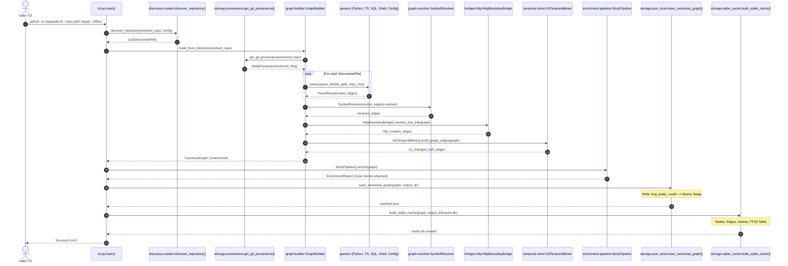

# Primary Workflow: Repository Ingestion & Full Graph Construction

## 1. Workflow Metadata
- **Initiator:** Developer, CI pipeline, or agent executing repository indexing.
- **Trigger:** Running `python -m repopeek.cli --repo-path <path> [--offline] [--output-dir <dir>]`.
- **Entry Point:** [`repopeek.cli.main()`](file:///c:/Users/pkumar2/OneDrive%20-%20Data%20Axle/Documents/AI_INIT/Repopeek/repopeek/cli.py#L230).
- **Primary Modules:**
  - [`repopeek.discovery.crawler.discover_repository()`](file:///c:/Users/pkumar2/OneDrive%20-%20Data%20Axle/Documents/AI_INIT/Repopeek/repopeek/discovery/crawler.py#L29)
  - [`repopeek.graph.builder.GraphBuilder.build_from_directory()`](file:///c:/Users/pkumar2/OneDrive%20-%20Data%20Axle/Documents/AI_INIT/Repopeek/repopeek/graph/builder.py#L96)
  - [`repopeek.enrichment.pipeline.StoryPipeline.enrich()`](file:///c:/Users/pkumar2/OneDrive%20-%20Data%20Axle/Documents/AI_INIT/Repopeek/repopeek/enrichment/pipeline.py#L54)
  - [`repopeek.storage.json_store.save_canonical_graph()`](file:///c:/Users/pkumar2/OneDrive%20-%20Data%20Axle/Documents/AI_INIT/Repopeek/repopeek/storage/json_store.py#L78)
  - [`repopeek.storage.sqlite_cache.build_sqlite_cache()`](file:///c:/Users/pkumar2/OneDrive%20-%20Data%20Axle/Documents/AI_INIT/Repopeek/repopeek/storage/sqlite_cache.py#L11)
- **Primary Tests:** [`tests/test_foundation.py`](file:///c:/Users/pkumar2/OneDrive%20-%20Data%20Axle/Documents/AI_INIT/Repopeek/tests/test_foundation.py), [`tests/test_graph_persistence.py`](file:///c:/Users/pkumar2/OneDrive%20-%20Data%20Axle/Documents/AI_INIT/Repopeek/tests/test_graph_persistence.py), [`tests/test_golden_scenarios.py`](file:///c:/Users/pkumar2/OneDrive%20-%20Data%20Axle/Documents/AI_INIT/Repopeek/tests/test_golden_scenarios.py).

---

## 2. Sequence Diagram

---

## 3. Step-by-Step Execution Walkthrough

### Step 1: CLI Initialization and Configuration
1. User invokes `python -m repopeek.cli`.
2. `cli.build_parser()` constructs command line arguments.
3. If `--config` is supplied, `RepopeekConfig.from_json_file()` loads JSON options; otherwise default `RepopeekConfig` is created with CLI overrides applied (`repo_path`, `output_dir`, `sql_dialect`).
4. Checks if target repository exists. If absent, prints an error to `stderr` and exits with code 1.

### Step 2: Discovery and File Filtering
1. `discover_repository()` in [`crawler.py`](file:///c:/Users/pkumar2/OneDrive%20-%20Data%20Axle/Documents/AI_INIT/Repopeek/repopeek/discovery/crawler.py) walks the directory tree using `os.walk(repo_root, topdown=True)`.
2. Directories are sorted in-place (`dirs.sort()`) for cross-platform determinism.
3. `IgnoreRuleSet.is_dir_ignored()` filters out ignored directories (`.git`, `node_modules`, `venv`, `__pycache__`, etc.).
4. Files are sorted (`files.sort()`). For each file:
   - Evaluates `ignore_rules.is_path_ignored(file_path)`.
   - Computes file size via `stat().st_size`.
   - Checks binary status: reads 8KB; if `\x00` is present, marks `skipped_binary`.
   - If size > `max_file_size_kb * 1024`, marks `skipped_size`.
   - Classifies file type via `classify_file()`: checks extension against `EXTENSION_MAP` or inspects shebang (`check_shebang()`).
   - Computes SHA-256 and git blob SHA (`blob <size>\0<content>`).
   - Returns a `DiscoveredFile` record with `parse_status = "pending"` if supported.

### Step 3: Git Provenance Anchoring
1. `get_git_provenance()` runs `git rev-parse HEAD` and `git status --porcelain` to determine current commit SHA and dirty state.
2. `compute_repo_blob_shas()` queries git blob hashes for all files in batch.
3. Every node and edge subsequently instantiated is tagged with this provenance metadata.

### Step 4: Polyglot Parsing
`GraphBuilder.build_from_directory()` iterates through each supported file:
1. Resolves file language (`python`, `typescript`, `javascript`, `sql`, `shell`, `json`, `yaml`).
2. Selects the appropriate parser from `self.parsers`.
3. Calls `parser.parse_file(file_path, repo_root=root)`:
   - File read with `encoding="utf-8", errors="replace"`.
   - Constructs root file card (`kind="file"`, `id="<lang>:<rel_path>::<file>"`).
   - AST / Lexical parsing extracts classes, functions, methods, queries, statements, configs.
   - Extracts local edges (`DEFINED_IN`, `CALLS`, `READS`, `WRITES`, `INHERITS`, `EMBEDS_SQL`, `RUNS_SCRIPT`).
   - Returns `ParseResult(nodes, edges, errors)`.

### Step 5: Symbol Resolution and Cross-Boundary Linking
1. Nodes and local edges from all parse results are loaded into `CanonicalGraph`.
2. `SymbolResolver` builds index maps:
   - `file_nodes`, `module_to_file`, `symbols_by_qualname`, `symbols_by_name`.
   - `tables_by_name`, `variables_by_qualname`, `configs_by_key`, `env_vars`.
3. `SymbolResolver.resolve()`:
   - Matches local file scope first, then file import aliases, then unique repository-wide symbols.
   - Sets edge confidence (`resolved`, `ambiguous`, `external`, `unresolved`).
4. `HttpBoundaryBridge.resolve_and_link()`:
   - Discovers backend route decorators (`ROUTE_DECORATOR_RE`, `FLASK_ROUTE_RE`, `EXPRESS_ROUTE_RE`) and `ROUTE:` facts.
   - Discovers client HTTP calls (`fetch`, `axios`).
   - Normalizes URLs into wildcard templates (`/api/users/:param`).
   - Synthesizes `INVOKES` edges with confidence `RESOLVED`.
5. `GitTemporalMiner.build_graph_edges()`:
   - Mines up to 2000 non-merge commits from `git log`.
   - Computes time-decayed co-occurrence probabilities.
   - Materializes `CO_CHANGED_WITH` edges between coupled files.

### Step 6: 5-Tier Semantic Story Enrichment
1. `StoryPipeline` partitions all nodes into 4 topological tiers:
   - Functions & methods.
   - Classes.
   - Modules / files.
   - Entities, tables, queries, configs, scripts.
2. Bottom-up generation:
   - Functions & methods are processed first.
   - Trivial nodes (complexity == 1, 0 calls/reads/writes) bypass LLM -> `DeterministicStoryBuilder`.
   - Checks SHA-256 story cache on disk.
   - If offline or budget exhausted -> `DeterministicStoryBuilder`.
   - Otherwise invokes Groq chat completion API (FAST model for complexity < 10, STRONG model for complexity $\ge 10$).
   - `FactVerifier` validates generated summary against AST facts. On failure, falls back to deterministic template.
   - Class summaries consume child method stories.
   - Module summaries consume child class and function stories.

### Step 7: Persistence and Sharding (Atomic Swap)
1. `save_canonical_graph()` creates temporary staging folder `.tmp_build_<uuid>`.
2. Serializes `graph.json` with stably sorted nodes (by ID) and edges (by src, dst, type, confidence).
3. Projects and serializes 9 specialized lenses into `lenses/*.json`.
4. Shards nodes and edges by source file into `shards/*.json`.
5. Writes `manifest.json` with file counts, node counts, and SHA-256 hashes.
6. Atomically moves existing output directory to `.tmp_old_<uuid>` and renames staging directory to destination.
7. Purges `.tmp_old_<uuid>`.
8. `build_sqlite_cache()` creates `cache.db`, executes DDL, inserts nodes, edges, metadata, and populates `nodes_fts` FTS5 table with weighted columns.

---

## 4. Alternate Paths and Failure Modes

| Condition | Fallback / Behavior |
|---|---|
| Python file contains syntax errors | `PythonParser._parse_fallback()` activates regex parsing to extract top-level functions, classes, and imports. |
| SQL query dialect parse error | `SqlParser` tries default dialect (Oracle), then Postgres, then ANSI, then regex fallback extraction. |
| Groq API failure or rate limit | `HierarchicalStoryGenerator` catches exception, records fallback in `CostGovernor`, and generates deterministic story template. |
| Offline flag `--offline` passed | Bypasses all LLM network calls; completes indexing in seconds using zero-cost deterministic templates. |
| Atomic rename fails (Windows lock) | Directory copy and best-effort cleanup fallback to ensure output directory is populated. |
