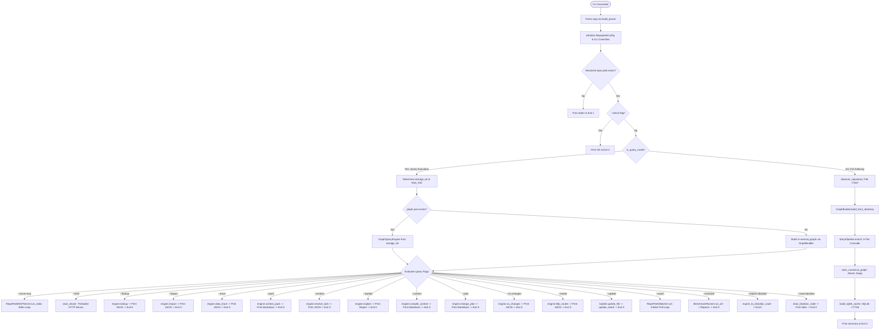

# Control Flow Specification

This document details the control flow, execution order, branching conditions, iteration loops, and recursion across all core workflows in RepoPeek.

---

## 1. CLI Execution and Query Dispatch Control Flow

Execution begins in `repopeek.cli.main(argv)`:



---

## 2. Blast Radius Multi-Hop Traversal (BFS with Queue)

The blast radius calculation in [`repopeek/graph/blast_radius.py:compute_blast_radius`](file:///c:/Users/pkumar2/OneDrive%20-%20Data%20Axle/Documents/AI_INIT/Repopeek/repopeek/graph/blast_radius.py#L316) runs a path-collecting Breadth-First Search (BFS) using a queue:

### State in Queue
```python
queue: deque = deque([(target_id, [], {target_id})])
# Tuple format: (current_node_id, current_steps_list, visited_node_ids_in_path)
```

### Execution Loop
1. **Adjacency Lookups:** Pre-builds or retrieves cached `incoming_edges` and `outgoing_edges` from the graph.
2. **Loop Condition:** While `queue` is non-empty:
   - Pop `(curr_id, current_steps, path_visited)`.
   - Calculate current `depth = len(current_steps)`.
   - If `depth >= max_depth` (default 5), terminate exploration along this path.
3. **Neighbor Expansion:**
   - If `direction in ("both", "upstream")`: inspect `incoming_edges[curr_id]`.
   - If `direction in ("both", "downstream")`: inspect `outgoing_edges[curr_id]`.
4. **Cycle Prevention:**
   - If `next_id in path_visited`: **prune immediately**. Cycles within a path are rejected.
5. **Hard Exclusion Pruning:**
   - Evaluates `is_node_excluded(next_id, next_node, exclusions)`.
   - If excluded: records an `ExcludedNode` with exclusion reason and **does NOT push to queue**.
6. **Path Recording:**
   - Constructs `step = BlastRadiusStep(...)`.
   - New path = `current_steps + [step]`.
   - Records path in `node_paths[next_id]`.
   - Pushes `(next_id, new_path, path_visited | {next_id})` to queue.
7. **Post-Processing (Mathematical Reduction):**
   - For every visited node:
     - Calculates path confidence for each path: $PathConfidence(P_j) = \min(0.99, \prod c_i \cdot e^{-0.25(h-1)})$.
     - Combines paths: $CombinedConfidence(N) = \min(0.99, 1 - \prod (1 - PathConfidence(P_j)))$.
     - Calculates graph score: $GraphScore(N) = CombinedConfidence(N) \cdot e^{-0.70(distance-1)}$.
   - Partitioning:
     - If $\text{CombinedConfidence}(N) \ge 0.80$ or $\text{distance} == 1$: place in `direct`.
     - Else if $\text{CombinedConfidence}(N) \ge \text{confidence\_threshold}$ (0.20): place in `indirect`.
     - Else: place in `excluded`.

---

## 3. 5-Tier Story Cascade (Bottom-Up Topological Sort)

In [`repopeek/enrichment/pipeline.py:enrich`](file:///c:/Users/pkumar2/OneDrive%20-%20Data%20Axle/Documents/AI_INIT/Repopeek/repopeek/enrichment/pipeline.py#L54), enrichment does not happen randomly; nodes are partitioned into 4 hierarchical levels:

1. **Partitioning:**
   - Bucket 1: `methods_and_funcs` (`kind in ("function", "method")`)
   - Bucket 2: `classes` (`kind == "class"`)
   - Bucket 3: `modules` (`kind in ("module", "file")`)
   - Bucket 4: `others` (`tables`, `queries`, `configs`, `scripts`)
2. **Phase 1: Leaf Functions & Methods:**
   - Iterates through `methods_and_funcs`.
   - Runs `HierarchicalStoryGenerator.generate_story(node)`:
     - Check `is_trivial_node(node)`: if complexity == 1 and 0 calls/reads/writes -> Tier 1 `DeterministicStoryBuilder`.
     - Check `StoryCache`: if cached -> Tier 2.
     - Check governor / offline: if budget exceeded or offline -> Tier 1.
     - Call LLM API (Groq).
     - Run `FactVerifier.verify()`: if invalid -> fall back to Tier 1.
3. **Phase 2: Classes (Hierarchical Map-Reduce):**
   - Iterates through `classes`.
   - Gathers `child_stories` from Phase 1 methods belonging to this class (`node.id.startswith(class_prefix)`).
   - Prompt provides child summaries to synthesize a holistic class story.
4. **Phase 3: Modules / Files:**
   - Iterates through `modules`.
   - Gathers `child_stories` from Phase 1 and 2 nodes located within this file (`node.span.file == fpath`).
   - Generates module-level narrative summarizing interactions.
5. **Phase 4: Non-Code Entities:**
   - Generates stories for SQL tables, queries, shell scripts, and configs.

---

## 4. Incremental Watch Daemon Loop

In [`repopeek/daemon/watcher.py:run`](file:///c:/Users/pkumar2/OneDrive%20-%20Data%20Axle/Documents/AI_INIT/Repopeek/repopeek/daemon/watcher.py):

```python
while not self._stop_event.is_set():
    time.sleep(self.poll_interval)  # Default 1.0s
    changed_files = self.scan_changes()
    if changed_files:
        if self.debounce_sec > 0:
            time.sleep(self.debounce_sec)  # Debounce burst saves (150ms)
        for f in changed_files:
            elapsed_ms = self.sync_file(f)
```

### Single-File Sync Steps (`sync_file`)
1. `GraphBuilder.update_file(file_path, graph)`:
   - Purges all old nodes where `node.span.file == rel_path`.
   - Purges all edges where `src` or `dst` was in purged node set.
   - Re-parses single file on disk via relevant language parser.
   - Adds new nodes.
   - Runs `SymbolResolver(nodes=all_nodes, edges=file_edges).resolve()` to re-link edges.
   - Runs `HttpBoundaryBridge.resolve_and_link()` to re-link HTTP edges.
2. `update_file_shard(output_dir, rel_path, graph)`:
   - Overwrites `shards/<file>.json`.
   - Synchronizes `graph.json` and `manifest.json`.
3. `update_sqlite_file(rel_path, graph, db_path)`:
   - Executes `DELETE FROM nodes WHERE file = ?`.
   - Executes `DELETE FROM edges WHERE ...`.
   - `INSERT OR REPLACE INTO nodes ...`.
   - `INSERT INTO edges ...`.
   - Updates FTS5 `nodes_fts` index.
4. Measured time: typically 15ms - 45ms.

---

## 5. MCP Server Stdio Event Loop

In [`repopeek/query/mcp_server.py:run_stdio`](file:///c:/Users/pkumar2/OneDrive%20-%20Data%20Axle/Documents/AI_INIT/Repopeek/repopeek/query/mcp_server.py):

1. **Input Loop:** Iterates over `sys.stdin`:
   - Strips newline and whitespace.
   - Parses line as JSON-RPC object (`req = json.loads(line)`).
2. **Method Routing:**
   - `method == "initialize"`: Returns protocol version (`2024-11-05`), server info (`repopeek-mcp v0.1.0`), and empty capabilities.
   - `method == "notifications/initialized"`: No-op return.
   - `method == "tools/list"`: Returns metadata and JSON schemas for all 10 MCP tools.
   - `method == "tools/call"`: Dispatches to `_execute_tool(req_id, tool_name, tool_args)`.
3. **Output Emission:**
   - Serializes response to single-line JSON.
   - Writes to `sys.stdout.write(json.dumps(res) + "\n")`.
   - Executes `sys.stdout.flush()`.
4. **Termination:** Loop terminates when stdin reaches EOF or process receives SIGINT/SIGTERM.
