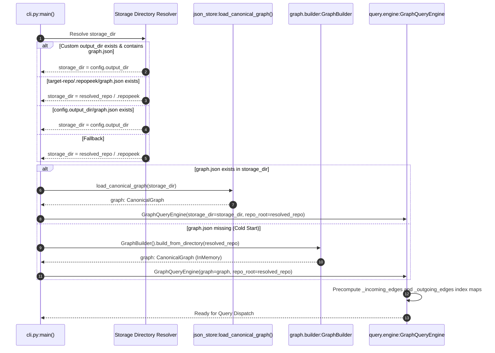

# Startup and Initialization Sequences

This document outlines the bootstrapping sequences, resource allocations, and dependency checks executed during process startup across RepoPeek's operational modes.

---

## 1. Engine Bootstrapping & Storage Resolution

Whenever a query mode is invoked (e.g. `--lookup`, `--impact`, `--context`, `--serve-mcp`, `--view`), `cli.main()` bootstraps the `GraphQueryEngine`:



---

## 2. MCP Server Bootstrapping Sequence

When invoked with `--serve-mcp`:

1. **Stdio Preparation:**
   - Client launches `python -m repopeek.cli --repo-path <path> --serve-mcp`.
   - `PYTHONUNBUFFERED=1` is recommended to prevent output buffering.
2. **Server Instantiation:**
   - `server = RepoPeekMCPServer(engine)`.
3. **JSON-RPC Handshake:**
   - Client sends `{"jsonrpc": "2.0", "id": 1, "method": "initialize", "params": {...}}`.
   - Server returns:
     ```json
     {
       "jsonrpc": "2.0",
       "id": 1,
       "result": {
         "protocolVersion": "2024-11-05",
         "serverInfo": { "name": "repopeek-mcp", "version": "0.1.0" },
         "capabilities": { "tools": {} }
       }
     }
     ```
   - Client sends notification `{"jsonrpc": "2.0", "method": "notifications/initialized"}`. Server ignores and continues.
   - Client requests `{"jsonrpc": "2.0", "id": 2, "method": "tools/list"}`. Server returns schemas for all 10 tools.

---

## 3. Interactive Web Viewer Bootstrapping Sequence

When invoked with `--view [--port 8765]`:

1. **Handler Configuration:**
   - Dynamically binds `engine` and `storage_dir` to `GraphViewerHandler`.
2. **Server Socket Binding:**
   - Instantiates `ThreadingHTTPServer(("127.0.0.1", port), handler)`.
   - Sets `server.daemon_threads = True` so worker threads do not block shutdown.
3. **Browser Launch:**
   - Calls `webbrowser.open(f"http://127.0.0.1:{port}")` on a background thread.
4. **Event Loop:**
   - Calls `server.serve_forever()`.

---

## 4. Incremental Watch Daemon Bootstrapping Sequence

When invoked with `--watch [--watch-interval 1.0]`:

1. **Baseline Snapshot Acquisition:**
   - Calls `_initialize_snapshot()`:
     - Scans repository via `discover_repository(repo_root)`.
     - Records initial file modification timestamps (`st_mtime_ns`) and sizes (`st_size`) in `_file_states: Dict[str, FileState]`.
2. **Graph Attachment:**
   - Loads existing graph from `storage_dir / "graph.json"` or builds fresh in-memory graph.
3. **Poll Loop Activation:**
   - Starts polling interval timer loop.
