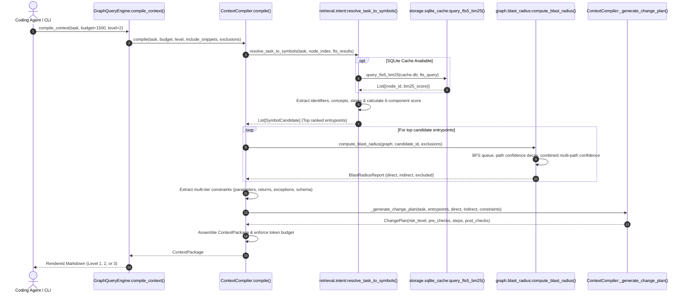

# Query and Context Compilation Workflow

## 1. Workflow Overview
- **Initiator:** AI Coding Agent (via MCP `repopeek_context`, `repopeek_plan`) or Developer (via CLI `--context`, `--plan`, `--resolve`, `--pack`).
- **Goal:** Transform a high-level natural language engineering task into a compact, evidence-backed context package (<500 to 1500 tokens) with multi-tier structural constraints, exact blast radius reachability, and an actionable change plan.
- **Primary Modules:**
  - [`repopeek.retrieval.intent`](file:///c:/Users/pkumar2/OneDrive%20-%20Data%20Axle/Documents/AI_INIT/Repopeek/repopeek/retrieval/intent.py)
  - [`repopeek.graph.blast_radius`](file:///c:/Users/pkumar2/OneDrive%20-%20Data%20Axle/Documents/AI_INIT/Repopeek/repopeek/graph/blast_radius.py)
  - [`repopeek.context.compiler`](file:///c:/Users/pkumar2/OneDrive%20-%20Data%20Axle/Documents/AI_INIT/Repopeek/repopeek/context/compiler.py)
  - [`repopeek.query.engine`](file:///c:/Users/pkumar2/OneDrive%20-%20Data%20Axle/Documents/AI_INIT/Repopeek/repopeek/query/engine.py)

---

## 2. Sequence Diagram

---

## 3. Step-by-Step Processing

### Phase 1: Task-to-Symbol Intent Resolution
1. **Query Normalization (`extract_task_identifiers`):**
   - Strips punctuation and normalizes casing.
   - Extracts explicit code identifiers using regexes (`_DOTTED_NAME_RE`, `_QUOTED_RE`, `_PATH_RE`, `_SNAKE_RE`, `_CONSTANT_RE`).
   - Tokenizes concepts, filters stop words (`_STOP_WORDS`), and filters purely operational verbs (`_OPERATIONAL_VERBS` e.g. "add", "change", "update").
   - Retains technical verbs (`_TECHNICAL_VERBS` e.g. "validate", "parse", "normalize").
   - Applies conservative stemming (`normalize_term_stem`) to capture singular/plural and verb variations without over-stemming.
   - Generates adjacent bigram compounds (`compounds`).
   - Extracts explicit negative exclusion patterns using `_EXCLUSION_PATTERN` (e.g. `without modifying shipping` -> excludes `"shipping"`).
2. **Dual-Channel Candidate Retrieval:**
   - **Channel 1 (AST Search):** Scans the in-memory AST identifier index, matching qualified names, signatures, and symbol suffixes.
   - **Channel 2 (SQLite FTS5 BM25):** Executes weighted BM25 full-text search against `nodes_fts` (`qualified_name: 5.0, symbol_name: 5.0, sig: 4.0, file_path: 2.5, story_text: 1.5`).
3. **Calibrated Multi-Component Scoring:**
   $$\text{Score} = 0.35 \cdot \text{exact\_match} + 0.25 \cdot \text{identifier} + 0.20 \cdot \text{token\_overlap} + 0.10 \cdot \text{lexical} + 0.05 \cdot \text{path\_rel} + 0.05 \cdot \text{kind\_pref}$$
   - Returns ranked `List[SymbolCandidate]`.

---

### Phase 2: Mathematical Blast Radius Traversal
For the top resolved entrypoint symbols:
1. Invokes `compute_blast_radius()` in [`blast_radius.py`](file:///c:/Users/pkumar2/OneDrive%20-%20Data%20Axle/Documents/AI_INIT/Repopeek/repopeek/graph/blast_radius.py#L316).
2. Traverses incoming (`upstream`) and outgoing (`downstream`) edges up to `max_depth` (default 5).
3. Evaluates hard negative exclusion rules: any symbol or file matching `exclusions` is immediately pruned and categorized as `ExcludedNode`.
4. Calculates path decay factor $\exp(-0.25 \cdot (h - 1))$ and combines independent paths via noisy-or formula.
5. Classifies reachable nodes into:
   - `direct`: 1-hop dependencies or $\ge 0.80$ combined confidence.
   - `indirect`: Multi-hop dependencies with confidence $\ge 0.20$.
   - `excluded`: Confidence $< 0.20$ or explicitly pruned.

---

### Phase 3: Multi-Tier Constraint Extraction
`ContextCompiler._extract_constraints()` inspects AST facts across the entrypoints and direct blast radius:
1. **Parameter Constraints:** Inspects `node.facts.params` and type annotations to enforce caller contract compatibility.
2. **Return Constraints:** Captures `node.facts.returns` to prevent breaking change signatures.
3. **Exception Constraints:** Extracts `node.facts.raises` (e.g. "Must preserve `ParseError` on invalid payloads").
4. **Database Schema Constraints:** Captures referenced tables in `node.facts.reads` and `node.facts.writes` (e.g. "Relies on schema table `invoices`").
5. **Behavioral Invariants:** Gathers negative constraints and file boundaries that must not be modified.

---

### Phase 4: Risk Assessment and Step-by-Step Change Plan
`ContextCompiler._generate_change_plan()` evaluates blast radius risk:
1. **Risk Scoring:**
   - Evaluates caller count, affected database tables, and cross-language boundaries.
   - If tables $> 1$ or callers $> 5$ -> `Risk Level = HIGH`.
   - If callers $> 2$ or cross-language boundaries exist -> `Risk Level = MEDIUM`.
   - Otherwise -> `Risk Level = LOW`.
2. **Phase 1: Pre-Change Verification:**
   - Identifies existing tests (`TESTS_CODE` edges) and commands to run prior to editing.
3. **Phase 2: Actionable Implementation Steps:**
   - Orders modification steps: Target function modification -> downstream caller adjustments -> database migrations.
4. **Phase 3: Post-Change Regression Validation:**
   - Identifies test suites to run after editing to verify no regressions occurred.

---

### Phase 5: Progressive Disclosure Packaging and Budget Enforcement
`ContextPackage.to_markdown(level)` formats the final context slice:
- **Level 1 (Brief, ~250-400 tokens):** Task, candidate entrypoints, direct blast radius count, high-level plan.
- **Level 2 (Standard, ~600-1000 tokens):** Adds parameter signatures, node stories, direct/indirect breakdown, and full constraint set.
- **Level 3 (Full, ~1200-1800 tokens):** Injects exact physical source code snippets extracted from disk for entrypoints and direct targets, enabling zero-file-read code modifications.
- **Budget Enforcement:** If estimated token count exceeds `token_budget`, lower-priority indirect nodes are iteratively pruned until compliance is achieved.
