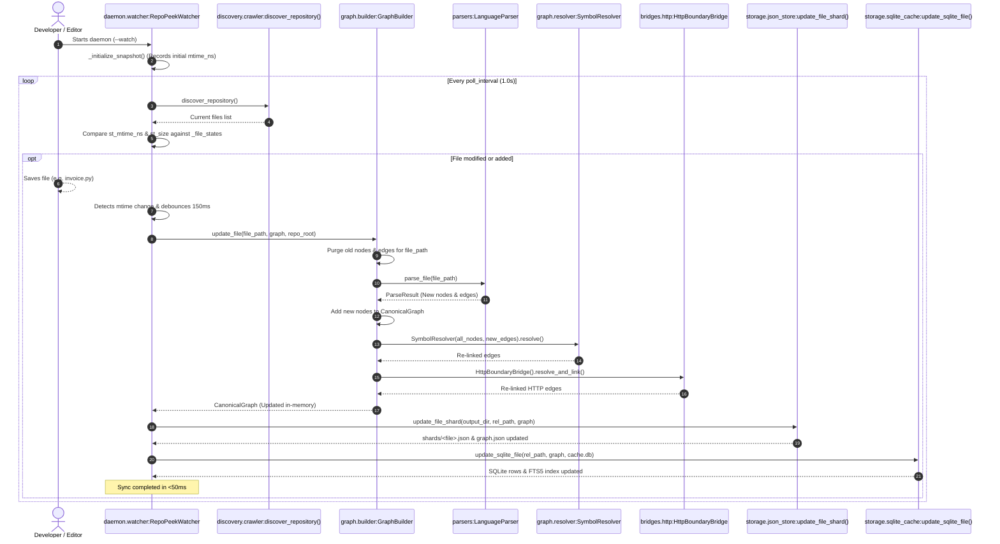

# Incremental Watch and Sync Workflow (<50ms)

## 1. Workflow Metadata
- **Initiator:** Background daemon started via `python -m repopeek.cli --watch [--watch-interval 1.0]`.
- **Goal:** Real-time synchronization of the in-memory canonical graph, disk shards, and SQLite search indices within 50 milliseconds of a file edit, without triggering a costly full-repository rebuild.
- **Primary Modules:**
  - [`repopeek.daemon.watcher.RepoPeekWatcher`](file:///c:/Users/pkumar2/OneDrive%20-%20Data%20Axle/Documents/AI_INIT/Repopeek/repopeek/daemon/watcher.py#L30)
  - [`repopeek.graph.builder.GraphBuilder.update_file()`](file:///c:/Users/pkumar2/OneDrive%20-%20Data%20Axle/Documents/AI_INIT/Repopeek/repopeek/graph/builder.py#L138)
  - [`repopeek.storage.json_store.update_file_shard()`](file:///c:/Users/pkumar2/OneDrive%20-%20Data%20Axle/Documents/AI_INIT/Repopeek/repopeek/storage/json_store.py#L224)
  - [`repopeek.storage.sqlite_cache.update_sqlite_file()`](file:///c:/Users/pkumar2/OneDrive%20-%20Data%20Axle/Documents/AI_INIT/Repopeek/repopeek/storage/sqlite_cache.py#L293)
- **Primary Tests:** [`tests/test_watch_daemon.py`](file:///c:/Users/pkumar2/OneDrive%20-%20Data%20Axle/Documents/AI_INIT/Repopeek/tests/test_watch_daemon.py).

---

## 2. Sequence Diagram

---

## 3. Step-by-Step Execution

### Step 1: Change Detection
1. `RepoPeekWatcher.scan_changes()` calls `discover_repository()`.
2. Inspects file metadata:
   - For every supported source file, compares `st.st_mtime_ns` and `st.st_size` against `self._file_states[rel_p]`.
   - If `mtime_ns` or `size_bytes` differs, appends the path to `changed` and updates the stored baseline state.
3. Checks for deleted files:
   - If a previously tracked file is missing from current disk files, identifies it as deleted.
   - Purges all nodes and edges associated with the deleted file from the graph.
4. Returns list of modified paths.

### Step 2: Debouncing Burst Writes
- If `changed` is non-empty and `debounce_ms > 0` (default 150ms), sleeps briefly.
- This prevents multiple rapid re-parses when editors perform atomic saves (write temporary -> flush -> rename).

### Step 3: Incremental In-Memory Graph Mutation (`GraphBuilder.update_file`)
1. Classifies file type and retrieves the matching parser (`PythonParser`, `TypeScriptParser`, etc.).
2. **Purge Old Nodes:**
   - Finds all node IDs in `graph.nodes` where `node.span.file == rel_path`.
   - Deletes them from `graph.nodes`.
3. **Purge Old Edges:**
   - Filters `graph.edges` to remove any edge where `src` or `dst` was in the purged node set.
4. **Re-parse File:**
   - Calls `parser.parse_file(file_path, repo_root)`.
   - Inserts newly extracted nodes into `graph.nodes`.
5. **Re-resolve Relational Edges:**
   - Re-runs `SymbolResolver` on the new local edges against all existing repository nodes.
   - Re-links cross-language HTTP routes via `HttpBoundaryBridge`.
6. Sets `graph.dirty = True`.

### Step 4: Storage Shard & Manifest Update (`update_file_shard`)
1. Writes updated node cards and edges for `rel_path` into `shards/<sanitized_name>.json`.
2. Updates `graph.json` in-place or re-dumps the serialized graph.
3. Updates `manifest.json` with the new shard SHA-256 and node count.

### Step 5: SQLite Database & FTS5 Sync (`update_sqlite_file`)
1. Connects to `cache.db`.
2. Executes `DELETE FROM nodes WHERE file = ?;` for the target file.
3. Executes `DELETE FROM edges WHERE ...;` for edges touching the old nodes.
4. Inserts new nodes into `nodes`.
5. Inserts new edges into `edges`.
6. Synchronizes `nodes_fts` (FTS5 table): deletes old records by `node_id` and inserts updated symbol names, signatures, and stories.
7. Commits transaction and closes connection.

---

## 4. Performance Guarantee

| Phase | Typical Latency | Standard Bound |
|---|---|---|
| Inode scan & mtime comparison | 3 - 8 ms | < 15 ms |
| Single-file AST re-parsing | 5 - 18 ms | < 30 ms |
| In-memory edge re-resolution | 2 - 6 ms | < 10 ms |
| Disk shard write & atomic sync | 4 - 10 ms | < 15 ms |
| SQLite delete, insert & FTS5 sync | 3 - 8 ms | < 15 ms |
| **Total Sync Latency** | **17 - 45 ms** | **< 50 ms** |
