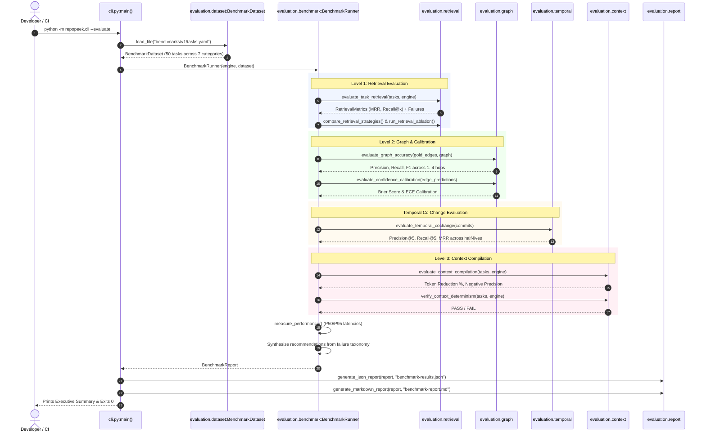

# Evaluation and Benchmarking Workflow

## 1. Workflow Metadata
- **Initiator:** Engineer or automated CI job executing quality validation.
- **Trigger:** Running `python -m repopeek.cli --evaluate [--dataset benchmarks/v1/tasks.yaml] [--output results.json] [--report report.md] [--eval-level all]`.
- **Primary Modules:**
  - [`repopeek.evaluation.benchmark.BenchmarkRunner`](file:///c:/Users/pkumar2/OneDrive%20-%20Data%20Axle/Documents/AI_INIT/Repopeek/repopeek/evaluation/benchmark.py#L87)
  - [`repopeek.evaluation.dataset.BenchmarkDataset`](file:///c:/Users/pkumar2/OneDrive%20-%20Data%20Axle/Documents/AI_INIT/Repopeek/repopeek/evaluation/dataset.py#L18)
  - [`repopeek.evaluation.retrieval`](file:///c:/Users/pkumar2/OneDrive%20-%20Data%20Axle/Documents/AI_INIT/Repopeek/repopeek/evaluation/retrieval.py)
  - [`repopeek.evaluation.graph`](file:///c:/Users/pkumar2/OneDrive%20-%20Data%20Axle/Documents/AI_INIT/Repopeek/repopeek/evaluation/graph.py)
  - [`repopeek.evaluation.context`](file:///c:/Users/pkumar2/OneDrive%20-%20Data%20Axle/Documents/AI_INIT/Repopeek/repopeek/evaluation/context.py)
  - [`repopeek.evaluation.report`](file:///c:/Users/pkumar2/OneDrive%20-%20Data%20Axle/Documents/AI_INIT/Repopeek/repopeek/evaluation/report.py)
- **Primary Tests:** [`tests/test_evaluation.py`](file:///c:/Users/pkumar2/OneDrive%20-%20Data%20Axle/Documents/AI_INIT/Repopeek/tests/test_evaluation.py).

---

## 2. 4-Level Evaluation Hierarchy

The benchmark harness executes four systematic evaluation tiers to ensure end-to-end reliability:

```text
Level 1: Symbol Retrieval Accuracy
  ├── Candidate Recall@50, Recall@100
  ├── Final Recall@1, Recall@3, Recall@5, Recall@10
  ├── Mean Reciprocal Rank (MRR)
  ├── Ablation Study (Baseline vs Stems vs Compounds)
  └── Strategy Comparison (AST vs BM25+RRF vs Embeddings)

Level 2: Graph Accuracy & Probabilistic Calibration
  ├── Multi-Hop Traversal Precision, Recall, F1 (1-hop to 4-hop)
  ├── Brier Score Calibration Check (target < 0.25)
  └── Empirical Accuracy vs Predicted Confidence Bins

Temporal Intelligence Evaluation
  ├── Chronological Cutoff Evaluation (zero future leakage)
  └── Co-Change Precision@k, Recall@k, MRR across half-life parameters

Level 3: Context Package Compilation & Token Efficiency
  ├── Token Reduction Percentage (target > 75%, typically > 95%)
  ├── Negative Constraint Precision & Recall (pruning excluded files)
  ├── Budget Compliance (100% adherence to token cap)
  └── Determinism Check (identical outputs across multiple runs)

Level 4: End-to-End Agent Benchmark
  ├── Controlled Task Execution (Assisted vs Baseline Unassisted)
  ├── Token Consumption Comparison
  ├── Tool Call Count Comparison
  └── Incorrect File Edit / Regression Rate
```

---

## 3. Sequence Diagram



---

## 4. Failure Taxonomy & Automated Triage

When a benchmark task fails to meet ground truth standards, it is categorized into an explicit failure enum ([`repopeek.evaluation.models.FailureCategory`](file:///c:/Users/pkumar2/OneDrive%20-%20Data%20Axle/Documents/AI_INIT/Repopeek/repopeek/evaluation/models.py#L8)):

1. `LEXICAL_MISS`: Query concept terms not present in symbol identifier, signature, or story text.
2. `IDENTIFIER_MISS`: Query references an identifier that was not matched in the symbol candidate pool.
3. `RANKING_ERROR`: Target symbol retrieved in top 50 candidates, but ranked outside top 5.
4. `GRAPH_MISSING_EDGE`: Expected dependency edge missing between two connected symbols.
5. `GRAPH_FALSE_EDGE`: Edge extracted that does not correspond to an actual runtime call or dependency.
6. `HTTP_BOUNDARY_MISS`: Client API call failed to link to its backend HTTP route handler.
7. `TEMPORAL_MISS`: Files frequently co-committed together lacked a `CO_CHANGED_WITH` edge.
8. `CONSTRAINT_MISS`: Structural constraint (exception, return type, table) omitted from compiled context.
9. `TEST_MISS`: Test file covering a modified function omitted from change plan.
10. `NEGATIVE_RETRIEVAL_FAILURE`: An excluded path specified in the task was erroneously included in context.
