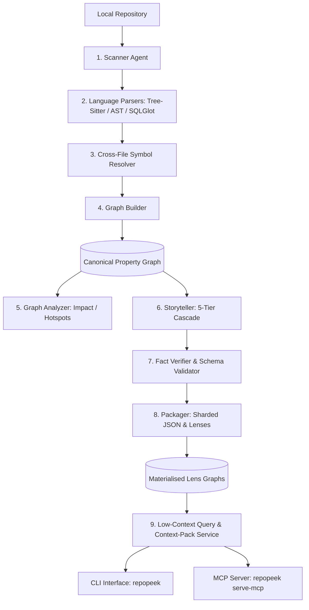

# Architecture — Map of Content

> Hub note for Repopeek multi-agent architecture and pipeline flow.

## High-Level Architecture Pipeline

## Core Agent & Component Pipeline Stages

1. **Scanner Stage:** [[comp-discovery]] — crawls repository, respects `.repopeekignore`, computes content & git blob SHAs.
2. **Deterministic Parsers:** [[comp-parsers]] — Python (AST + tree-sitter), SQL (SQLGlot Oracle/Postgres), Shell (tree-sitter-bash), JSON, YAML.
3. **Symbol Resolver:** Connects cross-file imports, method calls, and cross-language bridges (Python -> SQL tables, Shell -> Python scripts).
4. **Graph Builder:** [[comp-graph]] — builds in-memory NetworkX directed multigraph with stable URIs.
5. **Enrichment & Storyteller:** [[comp-enrichment]] — 5-tier cascade under cost governor, generating node card stories (see [[run-swap-llm-provider]] for provider guide).
6. **Query & Context-Pack Service:** [[comp-query]] — `lookup`, `neighbors`, `impact`, `data_trace`, and `context_pack`.
7. **Infrastructure & Interfaces:** [[comp-config]], [[comp-cli]], and [[adr-011-mcp-interface]].

## Cross-Cutting Architecture Decisions
- In-memory Property Graph: [[adr-001-networkx-local-graph]]
- Sharded JSON Persistence: [[adr-004-graph-persistence-tbd]]
- Hybrid Parser Stack: [[adr-005-python-parser-tbd]]
- Pluggable LLM Provider & Groq: [[adr-006-llm-provider-abstraction]]
- Story Cost Cascade: [[adr-007-story-cost-cascade]]
- Canonical Graph & 11 Lenses: [[adr-008-canonical-graph-lenses]]
- Git Provenance & Incremental Updates: [[adr-009-provenance-incremental-updates]]
- Asyncio Orchestration: [[adr-010-multi-agent-orchestration]]
- MCP Interface: [[adr-011-mcp-interface]]
- Secret Redaction & Privacy: [[adr-012-secrets-and-privacy]]

## Maps of Content
- Decisions: [[moc-decisions]]
- Data Models & Lenses: [[moc-data-models]]
- Features: [[moc-features]]
- Implementation Plan: [[plan-phase-2]]
